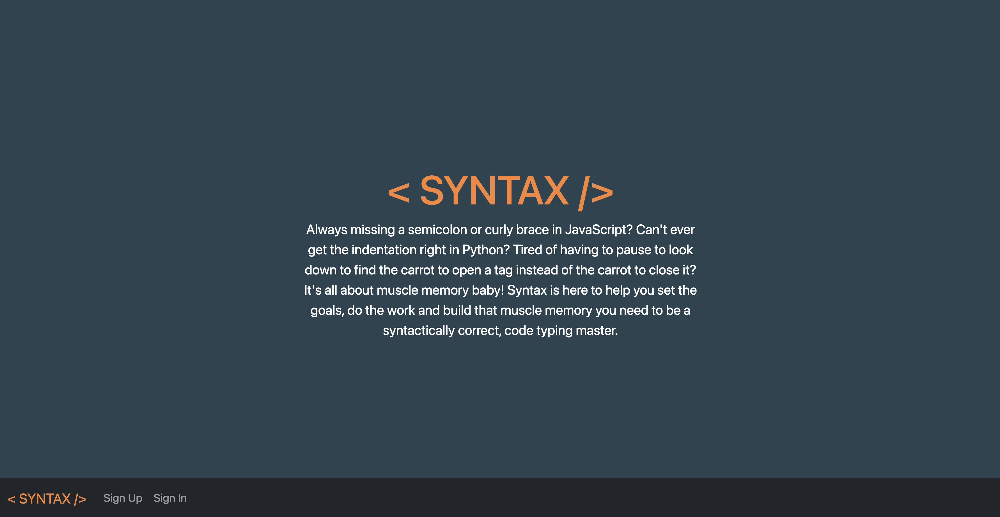
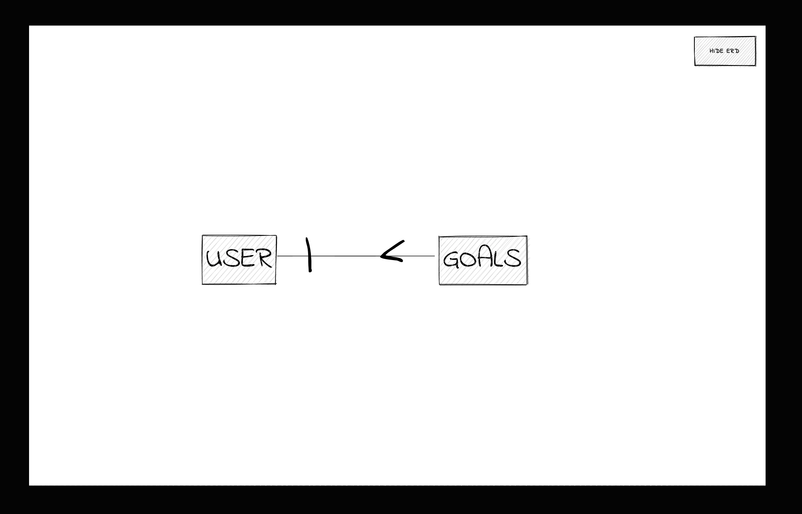

# < Syntax />

## About

< Syntax /> is a web app designed to hone the typing speed and syntactical skills of any developer. Developers of all levels can benefit from practicing the fundamentals. 

Don't believe me? [Give it a try](https://caldonic7.github.io/Syntax-Client/). Simply sign up (using a fake email is recommended), create a goal, then start practicing to see how fast you can level up and achieve your goals.

#

If you are interested in seeing how I created this app you can check out the code for my [front end repo](https://github.com/CaldoNic7/Syntax-Client) or my back end [API](https://syntax-typing-practice.herokuapp.com/) and it's corresponding [back end repo](https://github.com/CaldoNic7/Syntax-back-end).

#
## Technologies

Technologies I used to build this SPA include...

 + JavaScript

 + React

 + HTML/CSS

 + Bootstrap

 + Python

 + Django

 + PostSQL

## Installation

1. Fork and Clone this repository into a `django-env` directory.
2. Change into the new directory.
3. Run `pipenv shell` to start up your virtual environment.
4. Run `pipenv install django-rest-auth django-cors-headers python-dotenv dj-database-url` in the django-env folder.
5. Create a psql database with `createdb syntax_db`.
6. checkout to a new development branch with `git checkout -b dev`.
7. make your changes then add and commit them with `git add` and `git commit`
8. When finished, push to your fork with `git push origin dev` and submit a pull request.

#
## Outstanding Tasks
Here are some of the things I plan to tackle as I continue to work on developing this app...
  * Game Play
  * adding a username
  * profile with picture
  * Leader Board
  * Social interaction via comments and a chat function
  * User vs User Challenges
  * Trivia
  * Practice Problems
  

#

Entity Relationship Diagrams (ERD) and API Routes
### ERD

### API Routes

User Routes
| NAME         | URL       | Verb | AUTHENTICATED |          Description             |
|:------------:|:---------:|:----:|:-------------:|:--------------------------------:|
|signUp        |/sign-up/  |POST  |      NO       | creates new user                 |
|signIn        |/sign-in/  |POST  |      NO       | signs user in and creates token  |
|signOut       |/sing-out/ |DELETE|      YES      | signs user out and deletes token |
|changePassword|/change-pw/|PATCH |      YES      | changes user password            | 

Goal Routes
| NAME          | URL            | Verb  |          Description             |
|:-------------:|:--------------:|:-----:|:--------------------------------:|
|createGoal     |/goals/         |POST   | creates new goal                 |
|indexUserGoals |/goals/         |GET    | shows all of that users goals    |
|showGoal       |/goals/:goalId/ |GET    | shows a specific goal            |
|updateGoal     |/goals/:goalId/ |PATCH  | updates a goal                   | 
|deleteGoal     |/goals/:goalId/ |DELETE | deletes a goal                   | 

#

## Planning Process and Problem Solving Strategy
### Planning
I spent the entire first day planning my project and setting up the templates. I like to put pencil to paper first just to get all my ideas out and get them organized. Once I had a basic first draft and i had written down any "grand ideas" that are for future versions (allowing me to no think about them again until I am ready) I got busy making my wire frames. Once the wire frames were done I jotted down a general timeline and order of operations for the build. Then I got to work following those basic guidelines I had set for myself. 

### Problem Solving
Whenever I encountered a bug if there is an error code I made sure I understood what the error code was telling me before I tried any fixes. If I don't know whats wrong I don't know where to start trying to fix it. Once I understood what was wrong I worked through the order of events checking my code for obvious syntax mistakes if that applied and thinking through the logic of each step. A lot of times I could fix whatever was wrong or at least find exactly what was breaking the code that way. Once I knew where the code was broking and generally why, I started my search in the appropriate docs and on google to find a solution. If I got stuck for more than 10 minutes without making any progress i'd reach out to trusted peers and see if any of them had any advice or time to look at it with me. Most of the issues I had were resolved fairly quickly in this way but if I was still stuck then I created an issue ticket to get an instructors help.
#
